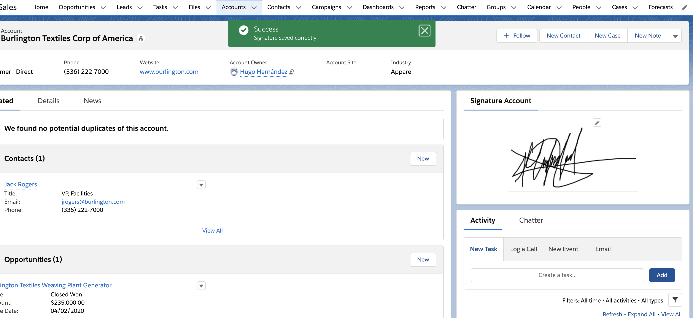

# Salesforce Lightning cmponent - Signature 

This lightning component help through canvasjs to draw in a lightning component a signature to save in Attachments.

## Part 1: Clone this repository

Once you have a local repository with my source create a SFDX project.

### Part 2: Create a SFDX Project

If you don't have experience creating SFDX projects please go here: [Link to create SFDX projects](https://gist.github.com/hugohernandezfcc/a8c6e765357ac2ca4be5c5907c0ab765)

Start from **Position yourself on the project folder** and push all my resources in your org with the following commands: 

	user@: sfdx force:source:deploy --loglevel fatal --sourcepath force-app/main/default/classes
	user@: sfdx force:source:deploy --loglevel fatal --sourcepath force-app/main/default/aura

That's all.

Happy coding.